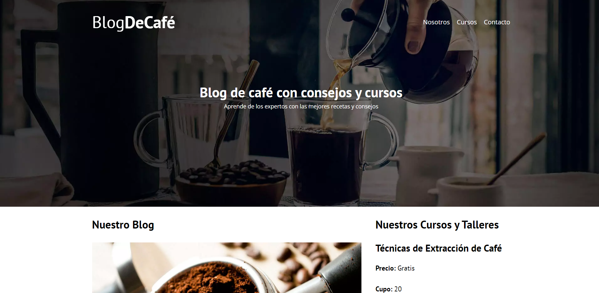
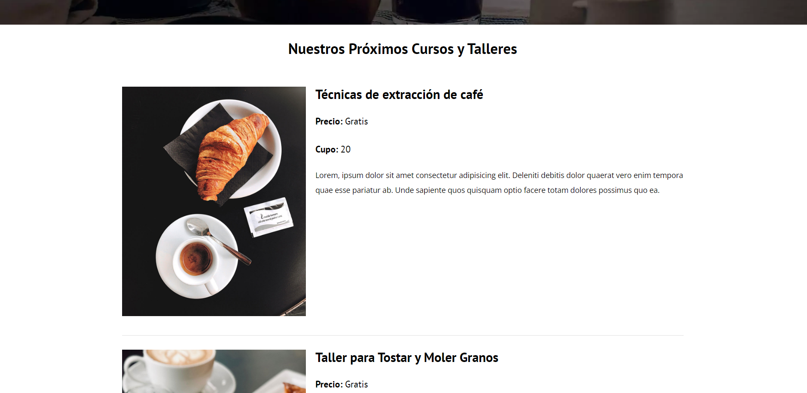
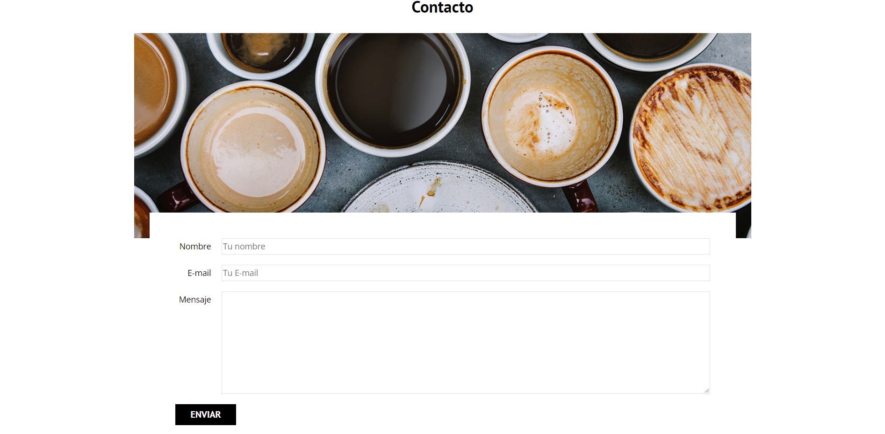

# Blog-de-cafe
### Front-end

## ¿Qué es? / What is it?
- Es una página web sencilla desarrollada en HTML y CSS, añadiendo JavaScript con Modernizr y controlando un formulario. Es un modelo de un Blog de Café, posee un home donde se muestra una previsualización de las entradas(pudiendo acceder a ellas) y 
de los cursos(pudiendo entrar a una vista más detallada). 
Incluye secciones de "Nosotros", "Cursos" y "Contacto" que cuenta con un formulario.
Lo realice con el curso de Udemy [Desarrollo Web Completo con HTML5, CSS3, JS AJAX PHP y MySQL](https://www.udemy.com/course/desarrollo-web-completo-con-html5-css3-js-php-y-mysql/)
- It is a simple web page developed in HTML and CSS, adding JavaScript with Modernizr and controlling a form. It is a model of a Coffee Blog, it has a home where a preview of the entries is shown (with access to them) and of the courses (being able to enter a more detailed view).
It includes sections of "About us", "Courses" and "Contact".
I did it with the Udemy course [Desarrollo Web Completo con HTML5, CSS3, JS AJAX PHP y MySQL](https://www.udemy.com/course/desarrollo-web-completo-con-html5-css3-js-php-y-mysql/)

## Capturas / Screenshots

    
    
    

